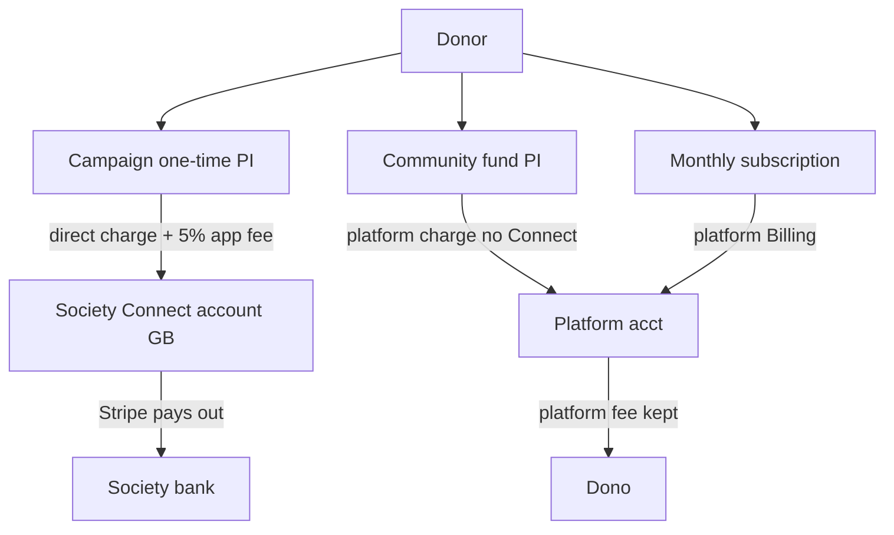

# Dono Stripe Setup Overview

**Generated:** 22 Jul 2026  
**Scope:** Test mode account `acct_1TrduJJSrO8JVmT4` (“Dono sandbox”), CLI display name `Dono sandbox`. Live mode was **not** queried (CLI config only had a test key). Combined from Stripe Dashboard/API state and this repo’s Convex/frontend integration.

---

## 1. Platform account (Dashboard)

| Field | Value |
|--------|--------|
| Account ID | `acct_1TrduJJSrO8JVmT4` |
| Mode | Test (`livemode: false`) |
| Type | Standard platform |
| Country | GB |
| Default currency | GBP |
| Business type | Individual |
| Business name | Dono sandbox |
| Website | https://joindono.com |
| MCC | `5734` (Computer Software Stores) |
| Dashboard email | `dono.outreach@gmail.com` |
| Charges / payouts | Enabled |
| Details submitted | Yes |
| Statement descriptor | `DONO SANDBOX` |
| Timezone | `Etc/UTC` |
| Payout schedule | Daily, **3-day** delay |
| Debit negative balances | On |

**Active platform capabilities (sample):** card, Link, Klarna, Bancontact, BLIK, EPS, Amazon Pay, Pix, Kakao/Naver/PAYCO, Samsung Pay, Satispay, MB Way, transfers. Cartes Bancaires pending; Scalapay inactive.

**Balance (test, at scrape time):** available **−£2.50**, pending **£957.68** (card).

---

## 2. Architecture (how money moves)

Dono is a **Connect marketplace / crowdfunding platform** with three payment paths:

### Campaign donations (primary path)

- **Charge type:** Direct charges on the society’s connected account (`stripeAccount` on PaymentIntent create).
- **Fee:** `application_fee_amount` = **5%** of gross (`PLATFORM_FEE_RATE = 0.05` in `convex/lib/platformFee.ts`).
- **Currency:** GBP only; amounts £1–£100,000 (`convex/lib/donationAmounts.ts`).
- **Payment methods:** `automatic_payment_methods: { enabled: true }` (Dashboard payment method configuration drives what’s offered).
- **UI:** Web = Payment Element; Native = Payment Sheet with `stripeAccountId` + Apple Pay merchant ID `merchant.com.dono.app`.

### Community fund donations

- Charged on the **platform** account (no Connect / no application fee in code).
- Allocated across matching-category public campaigns after success.

### Recurring (monthly) campaign donations

- Stripe **Customers + Prices + Subscriptions** on the **platform** (not Connect / no `application_fee` in create path).
- Signed-in only; native monthly is not fully supported in the donate sheet.

**Implication:** One-time campaign gifts go to societies via Connect; monthly and fund gifts settle on the platform first. That’s an intentional asymmetry in the current code.

---

## 3. Stripe Connect

### Account model (code)

Uses **Accounts v2** (`stripe.v2.core.accounts` + `accountLinks`) via `convex/lib/stripeConnectMerchant.ts` and `convex/stripeConnect.ts`:

| Setting | Value |
|---------|--------|
| Country | GB |
| Currency default | GBP |
| Dashboard | **Full** (`dashboard: "full"`) |
| Fee collector | Stripe (`fees_collector: "stripe"`) |
| Loss liability | Stripe (`losses_collector: "stripe"`) |
| Capability | `card_payments` requested |
| Onboarding | Account Links `use_case: account_onboarding` / merchant config |

Legacy **v1** rows are deleted/forced to re-onboard; donations require `accountVersion === "v2"` and `cardPaymentsActive`.

### Connected accounts (test, at scrape time)

- **9** connected accounts listed
- **6** with `charges_enabled: true`
- Controllers match **application-controlled, full Dashboard, Stripe collects fees/requirements, Stripe bears payment losses** — consistent with the v2 merchant params above.

Society Connect is **community-scoped** (`stripeConnectAccounts.communitySlug`) so leaders share one merchant account per society. Dashboard access for leaders is the normal Stripe login URL (not Express login links).

---

## 4. Stripe Identity

Used for **society creators** and **campaign creators** (document + matching selfie):

- Sessions: `type: "document"`, `require_matching_selfie: true`
- Web: `stripe.verifyIdentity(clientSecret)` (`lib/stripe/launch-identity-verification.web.ts`)
- Native: opens hosted verification URL in the system browser (`lib/stripe/launch-identity-verification.native.ts`)
- Webhook: `POST /stripe/identity-webhook` with `STRIPE_IDENTITY_WEBHOOK_SECRET`
- Events: `verified`, `requires_input`, canceled/path cleanup
- Fallback: client polls refresh actions if webhooks lag

Test account has Identity activity (verification sessions present).

---

## 5. Webhooks

### Expected in code (`convex/http.ts`)

| Path | Purpose | Secret env |
|------|---------|------------|
| `/stripe/webhook` | Payments + Connect merchant updates | `STRIPE_CONNECT_WEBHOOK_SECRET` **or** `STRIPE_WEBHOOK_SECRET` |
| `/stripe/identity-webhook` | Identity only | `STRIPE_IDENTITY_WEBHOOK_SECRET` |

Target host pattern: `*.convex.site` (not Vercel). See `.env.local.example`.

### Handled payment/Connect events (`convex/stripeWebhook.ts`)

- `payment_intent.succeeded` / `payment_intent.payment_failed`
- `charge.refunded` (+ application-fee refund delta)
- `charge.dispute.created` / `charge.dispute.closed` (won/lost + fee refund on loss)
- `invoice.paid` / `invoice.payment_failed`
- `customer.subscription.deleted`
- v2 merchant: `v2.core.account[configuration.merchant].capability_status_updated` / `.updated`

Idempotency via `stripeWebhookEvents` + `shouldProcessWebhookEvent`.

### Dashboard API result (test, at scrape time)

**`GET /v1/webhook_endpoints` returned `[]` for this test account.**

So either:

1. Endpoints were never registered on this sandbox Dashboard, or
2. You’re only forwarding with Stripe CLI locally, or
3. Production/live has endpoints on another account/mode not linked in CLI.

Confirm/create endpoints on the Convex site URLs before relying on webhooks in shared test or prod. The app also confirms one-time success via `confirmOneTimeDonation`, so some flows work without webhooks — but Connect status, refunds, disputes, and subscriptions need them.

---

## 6. Payment method configuration (Dashboard)

Default PMC `pmc_1TrdurJSrO8JVmT4A8kKxZ9y` — **ON:**

`card`, `apple_pay`, `link`, `klarna`, `amazon_pay`, `bancontact`, `blik`, `eps`, `kakao_pay`, `naver_pay`, `payco`, `pix`, `revolut_pay`, `samsung_pay`, `satispay`, `mb_way`

Notable **OFF:** Google Pay, iDEAL, Bacs Debit, Affirm, Afterpay, Alipay, crypto, customer_balance, etc.

**Apple Pay domains:** none registered via API (`/v1/apple_pay/domains` empty). Native still sets `merchantIdentifier: "merchant.com.dono.app"` — Apple Pay on web may need domain verification for production.

---

## 7. App / SDK stack

| Layer | Package / usage |
|-------|------------------|
| Server (Convex `"use node"`) | `stripe@22.3.1` |
| Web | `@stripe/stripe-js`, `@stripe/react-stripe-js` (Elements + Payment Element) |
| Native | `@stripe/stripe-react-native` (Payment Sheet) |
| Env (client) | `EXPO_PUBLIC_STRIPE_PUBLISHABLE_KEY` |
| Env (Convex) | `STRIPE_SECRET_KEY`, webhook secrets above |

Secrets live on the **Convex deployment**, not only `.env.local`. Publishable key is Expo/Vercel `EXPO_PUBLIC_*`.

### Key source files

- `convex/stripe.ts` — PaymentIntents, funds, subscriptions, confirm/abandon
- `convex/stripeConnect.ts` — Connect onboarding / status / dashboard link
- `convex/stripeWebhook.ts` — payments + Connect webhooks
- `convex/societyIdentity.ts` / `convex/campaignIdentity.ts` — Identity sessions
- `convex/societyIdentityWebhook.ts` — Identity webhook
- `components/donate-sheet.web.tsx` / `components/donate-sheet.native.tsx` — donor UI
- `lib/stripe/provider.native.tsx` — native StripeProvider

---

## 8. Data model (Convex)

| Table | Role |
|-------|------|
| `stripeCustomers` | User ↔ Stripe Customer (funds / subscriptions) |
| `stripeConnectAccounts` | Society merchant (v1/v2, capability flags) |
| `donations` | Pending/succeeded/failed/refunded + fee + dispute fields |
| `recurringDonations` | Subscription linkage |
| `stripeWebhookEvents` | Idempotency |
| `campaignPayouts` | Transfer tracking schema (legacy/separate path) |
| Societies / campaigns | `stripeVerificationSessionId` + Identity fields |

---

## 9. Security / ops controls in code

- Server-side auth for most money actions; guest one-time allowed with email validation
- Admins blocked from donating (`assertNotAdminDonor`)
- Rate limits on PI / subscription / Identity create
- Max 10 pending donations per user
- Webhook signature verification
- Idempotent donation success mutations
- Connect access gated by society leadership checks
- Never trust client-sent “charges enabled” — re-check from DB / Stripe

---

## 10. Gaps & risks

1. **No Dashboard webhook endpoints** on the linked test account — highest-priority config gap.
2. **Charge pattern split:** campaign one-time = Connect direct + 5%; monthly/fund = platform — fee/payout story differs.
3. **Recent platform PaymentIntents** with campaign metadata showed `application_fee_amount: null` at scrape time — likely older/non-Connect tests; current campaign PIs should live on connected accounts with fees.
4. **Apple Pay:** enabled in PMC, but **no registered domains**; confirm Apple Developer merchant ID alignment.
5. **Google Pay off** in default PMC.
6. **Negative available balance** in test (normal for refunds/fees in sandbox, but watch live).
7. **Live mode** not reviewed in this document — repeat the scrape with live keys before go-live.
8. Prefer **restricted API keys** (`rk_`) over raw `sk_` where possible.

---

## 11. Env checklist

**Convex**

- `STRIPE_SECRET_KEY`
- `STRIPE_WEBHOOK_SECRET` and/or `STRIPE_CONNECT_WEBHOOK_SECRET`
- `STRIPE_IDENTITY_WEBHOOK_SECRET`

**Client / hosting**

- `EXPO_PUBLIC_STRIPE_PUBLISHABLE_KEY`

**Stripe Dashboard (test + live)**

- Webhook → `{CONVEX_SITE}/stripe/webhook` (Connect events + payment events as needed)
- Webhook → `{CONVEX_SITE}/stripe/identity-webhook` (Identity events)
- Connect platform / Accounts v2 merchant onboarding enabled
- Identity product enabled
- Apple Pay domains + merchant ID for production web/native

---

## 12. Summary

Dono is a GB/GBP Connect platform (Accounts v2, full Dashboard, Stripe-liable) taking a 5% application fee on direct campaign charges, with separate platform Billing for monthly gifts, platform charges for community funds, Stripe Identity for creator KYC, and Payment Element / Payment Sheet frontends — but the linked test Dashboard currently showed zero registered webhook endpoints at scrape time, which is the main operational hole.
